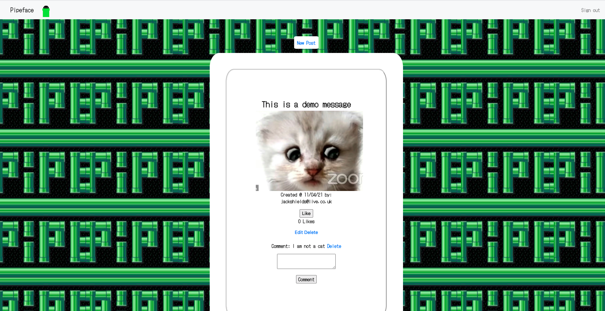

# AceBook - Pipeface




### Project
This project was created was undertaken as part of the Makers Academy Bootcamp and entailed working in a group of 5, in an agile environment that last for 2 weeks. We worked in 2 day sprints to deliver a facebook styled social media platform. The group decided on a pipeface character theme and developed our knowledge of Ruby, Ruby on Rails, RSpec, Bootstrap, CSS, CircleCI and we deployed the app via Heroku. The project was centered around implementing CRUD functionality to an application and the biggest challenges faced were around familiarizing ourselves with Rails (no prior working knowledge), deploying to Heroku (first time deploying) and CircleCI integration. 

We used [Trello](https://trello.com/b/gaYU7Ys1/pipeface-acebook) to plan our sprints and tasks. We also used GitHub issues to track issues and resolve them accordingly. The image above is a screenshot taken from the view a logged in user and the display of their feed.

REQUIRED INSTRUCTIONS:

1. Fork this repository to `acebook-teamname` and customize
the below**

[You can find the engineering project outline here.](https://github.com/makersacademy/course/tree/master/engineering_projects/rails)

2. The card wall is here: <please update>

## How to contribute to this project
See [CONTRIBUTING.md](CONTRIBUTING.md)

## Quickstart

First, clone this repository. Then:

```bash
> bundle install
> bin/rails db:create
> bin/rails db:migrate

> bundle exec rspec # Run the tests to ensure it works
> bin/rails server # Start the server at localhost:3000
```

## Troubleshooting

If you don't have Node.js installed yet, you might run into this error when running rspec:
```
ExecJS::RuntimeUnavailable:
  Could not find a JavaScript runtime. See https://github.com/rails/execjs for a list of available runtimes.
 ```
That is because Rails will use a Javascript runtime (such as Node) under the hood. The easiest way is to install Node by running `brew install node` -
and then run `bundle exec rspec` again
